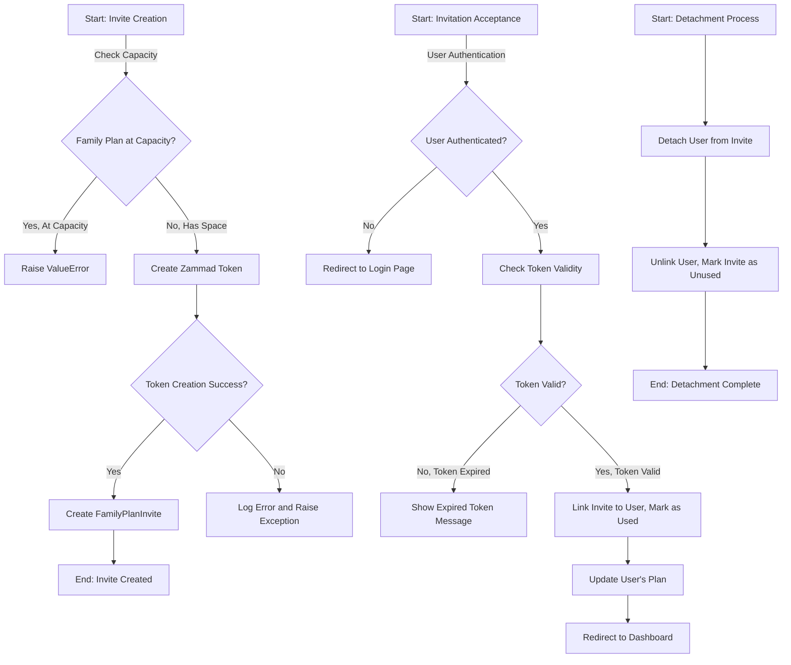

### Invite Creation Process:

1. **Start of Invite Creation**: The process begins with the intention to create an invite for the Family Plan.
2. **Capacity Check**: The system first checks if the Family Plan has reached its maximum capacity.
3. **Handling Capacity Limit**:
    * If the plan is at capacity, the process halts with an error indicating the plan is full.
    * If there's available space, the process moves to create a new invite token using the Zammad API.
4. **Token Generation**:
    * The Zammad API attempts to generate a unique token.
    * If the token generation fails, an error is logged, and an exception is raised.
    * If successful, a `FamilyPlanInvite` object is created with the generated token.
5. **End of Invite Creation**: The invite creation process concludes successfully once the invite object is created.

### Invitation Acceptance Process:

1. **Start of Invitation Acceptance**: This phase starts when a user attempts to accept an invitation.
2. **User Authentication Check**: It's verified whether the user accepting the invite is authenticated.
3. **Authenticated User Workflow**:
    * If the user is not authenticated, they are redirected to the login page.
    * If authenticated, the validity of the invite token is checked.
4. **Token Validity Check**:
    * If the token is expired, a message indicating the expired token is shown.
    * If the token is valid, the invite is linked to the authenticated user and marked as used.
5. **User Plan Update**: The user’s plan is updated according to the Family Plan specifics.
6. **Redirection Post-Acceptance**: After successful acceptance, the user is redirected to a dashboard or another relevant page.

### Detachment Process:

1. **Start of Detachment Process**: This process is initiated when detaching a user from the Family Plan.
2. **Detachment Execution**: The specific invite associated with the user is located, and the user is detached from it.
3. **Resetting Invite Status**: The invite’s link to the user is removed, and it is marked as unused.
4. **End of Detachment Process**: The process completes with the user successfully detached from the plan.

In this flow, the key operations include checking capacity limits, generating and validating tokens, handling user authentication, updating user plans, and managing the detachment of users. Each step is essential to maintain the integrity and functionality of the Family Plan feature in the Django application.

```python
import logging
import sentry_sdk
from sentry_sdk.integrations.django import DjangoIntegration

sentry_sdk.init(
    dsn="YOUR_SENTRY_DSN_HERE",
    integrations=[DjangoIntegration()],
    traces_sample_rate=1.0,
    send_default_pii=True
)

# Set up a logger
logger = logging.getLogger(__name__)

# Step 1: Model for Invite Link
from django.db import models
from zammad_py import ZammadAPI
from datetime import datetime, timedelta
from django.contrib.auth.models import User

class FamilyPlanInvite(models.Model):
    family_plan = models.ForeignKey('FamilyPlan', on_delete=models.CASCADE, related_name='invites')  # Related name for better query readability
    user = models.ForeignKey(User, on_delete=models.CASCADE)
    zammad_token = models.CharField(max_length=100, unique=True)  # Consider token length
    expires_at = models.DateTimeField()
    is_used = models.BooleanField(default=False)

    @staticmethod
    def create_invite_with_zammad_token(family_plan, user):
        if family_plan.is_at_capacity():
            raise ValueError("Family plan has reached its maximum capacity.")

        zammad_api = ZammadAPI()
        expiration_date = datetime.now() + timedelta(days=2)

        try:
            token_data = zammad_api.create_token(label="FamilyPlanInvite", expires_at=expiration_date)
        except ZammadAPIError as e:
            # Log the error for debugging and send to Sentry
            logger.error(f"Zammad API Error: {e}", exc_info=True)
            sentry_sdk.capture_exception(e)
            raise ValueError("Failed to create an invite token. Please try again later.")
        
        invite = FamilyPlanInvite.objects.create(
            family_plan=family_plan,
            user=user,
            zammad_token=token_data['token'],
            expires_at=expiration_date
        )
        return invite

# Steps 3 & 4: Invitation Acceptance Process
from django.contrib.auth.decorators import login_required
from django.utils.decorators import method_decorator
from django.shortcuts import redirect, render
from .models import FamilyPlanInvite

@method_decorator(login_required, name='dispatch')
class FamilyPlanInviteView(View):
    # Your view implementation here

# Step 5: User Acceptance and Account Transition Logic
def accept_invite(request, token):
    if not request.user.is_authenticated:
        return redirect('login-url')  # Redirect to the login page
    try:
        invite = FamilyPlanInvite.objects.get(zammad_token=token, is_used=False)
        if datetime.now() >= invite.expires_at:
            return render(request, 'expired_token.html', {'message': 'Your invite link has expired.'})

        # Assuming the user is already authenticated
        invite.user = request.user  # Link the invite to the authenticated user
        invite.is_used = True
        invite.save()

        # Implement logic to update the user's plan if needed
        # For example, you can update the user's plan here

        return redirect('dashboard-url')  # Redirect users to a dashboard or relevant page

    except FamilyPlanInvite.DoesNotExist:
        return redirect('invalid-token-url')

# Step 6: Detachment Logic
def detach_user_from_invite(invite):
    invite.user = None
    invite.is_used = False
    invite.save()
```

Please replace `"YOUR_SENTRY_DSN_HERE"` with your actual Sentry DSN.

# Admin Settings for Family Plan

## Step 1: Define a Model for Family Plan Settings

First, create a model that holds the configurable settings for the Family Plan feature. This model will store parameters like the user limit, which determines how many users can be part of a single family plan, including the main subscriber.

```python
from django.db import models

class FamilyPlanSettings(models.Model):
    user_limit = models.IntegerField(default=5, help_text="Maximum number of users in a family plan, including the main subscriber")

    class Meta:
        verbose_name = "Family Plan Setting"
        verbose_name_plural = "Family Plan Settings"

    def __str__(self):
        return "Family Plan Settings"
```

In this model definition:

* `user_limit` is an integer field with a default value of 5, representing the maximum number of users allowed in a family plan, including the primary subscriber.
    
* The `help_text` attribute provides a description for this field, making it clear for administrators.
    

## Step 2: Register the Settings Model with Django Admin

Next, make the model accessible through the Django admin interface for easy management. Register the model using Django's admin capabilities.

```python
from django.contrib import admin
from .models import FamilyPlanSettings

@admin.register(FamilyPlanSettings)
class FamilyPlanSettingsAdmin(admin.ModelAdmin):
    list_display = ['user_limit']
    fields = ['user_limit']
```

In this step:

* The `@admin.register` decorator registers the `FamilyPlanSettings` model with the Django admin, allowing you to manage these settings through the admin dashboard.
    
* `list_display` specifies that only the `user_limit` field will be displayed in the list view of `FamilyPlanSettings` objects in the admin interface.
    
* `fields` specifies that only the `user_limit` field is editable through the admin interface.
    

## Step 3: Access and Modify Settings via the Admin Dashboard

Now that you've registered the `FamilyPlanSettings` model with the Django admin, you can access and modify these settings through the admin dashboard:

1. Log in to the Django admin dashboard using your admin credentials.
    
2. Once logged in, navigate to the "Family Plan Settings" section. You should find it in the admin menu.
    
3. In the "Family Plan Settings" section, you will see the `user_limit` field displayed.
    
4. Modify the `user_limit` value as needed. For example, you can change it to a higher or lower number based on your requirements.
    

These steps allow an admin user to easily manage the user limit and other Family Plan settings through the user-friendly Django admin interface.

## Additional:

* **Singleton Pattern:** We only one set of Family Plan settings (which is often the case), consider implementing these settings as a singleton. This means there will be only one instance of `FamilyPlanSettings` in the database, ensuring consistency.
    
* **Read-Only Fields:** If certain settings should not be editable via the admin interface, you can mark them as read-only in the `FamilyPlanSettingsAdmin` class to prevent accidental modifications.
    
* **Validation:** Implement necessary validation in the `FamilyPlanSettings` model to ensure that the configurations are valid. For instance, you can add validation to prevent negative numbers for the `user_limit` field.
    
* **Dynamic Access:** In the application logic, such as the `create_invite_with_zammad_token` method, fetch these settings dynamically from the `FamilyPlanSettings` instance to ensure that we always have the latest configuration values. This ensures that your application behaves according to the most up-to-date settings.
